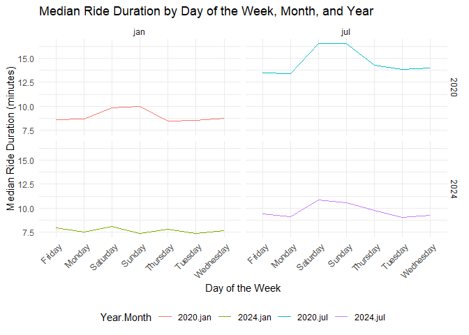
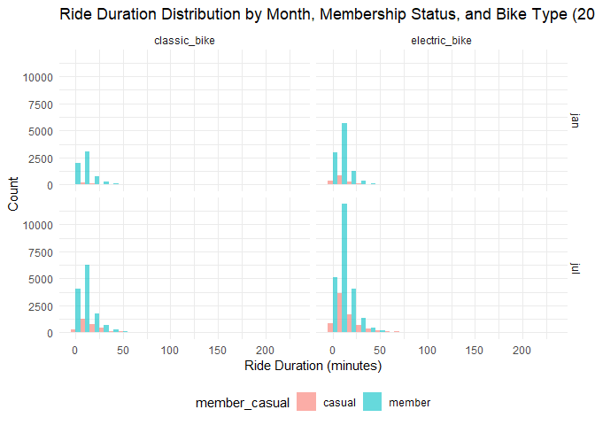

p8105_hw3_cj2793
================
Chenyu Jin
2024-10-08

# Problem 2

## Imort data sets

``` r
library(tidyverse)
```

    ## ── Attaching core tidyverse packages ──────────────────────── tidyverse 2.0.0 ──
    ## ✔ dplyr     1.1.4     ✔ readr     2.1.5
    ## ✔ forcats   1.0.0     ✔ stringr   1.5.1
    ## ✔ ggplot2   3.5.1     ✔ tibble    3.2.1
    ## ✔ lubridate 1.9.3     ✔ tidyr     1.3.1
    ## ✔ purrr     1.0.2     
    ## ── Conflicts ────────────────────────────────────────── tidyverse_conflicts() ──
    ## ✖ dplyr::filter() masks stats::filter()
    ## ✖ dplyr::lag()    masks stats::lag()
    ## ℹ Use the conflicted package (<http://conflicted.r-lib.org/>) to force all conflicts to become errors

``` r
nhanes_accel <- read_csv("hw3data/nhanes_accel.csv") |>
  janitor::clean_names()
```

    ## Rows: 250 Columns: 1441
    ## ── Column specification ────────────────────────────────────────────────────────
    ## Delimiter: ","
    ## dbl (1441): SEQN, min1, min2, min3, min4, min5, min6, min7, min8, min9, min1...
    ## 
    ## ℹ Use `spec()` to retrieve the full column specification for this data.
    ## ℹ Specify the column types or set `show_col_types = FALSE` to quiet this message.

``` r
nhanes_covar <- read_csv("hw3data/nhanes_covar.csv", skip = 4)
```

    ## Rows: 250 Columns: 5
    ## ── Column specification ────────────────────────────────────────────────────────
    ## Delimiter: ","
    ## dbl (5): SEQN, sex, age, BMI, education
    ## 
    ## ℹ Use `spec()` to retrieve the full column specification for this data.
    ## ℹ Specify the column types or set `show_col_types = FALSE` to quiet this message.

``` r
colnames(nhanes_covar) <- c("seqn", "sex", "age", "bmi", "education")
```

## Encode data with reasonable variable classes; Filter out participants less than 21 years of age and those with missing demographic data in `nhanes_covar`data set

Here we assume for `sex`, “1” is Male and “2” is female; And we assume
for `education`, “1” is low, “2” is median and “3” is high

``` r
nhanes_covar <- nhanes_covar |>
  mutate(
    seqn = as.integer(seqn),
    sex = factor(sex, levels = c(1, 2), labels = c("Male", "Female")),
    age = as.numeric(age),
    bmi = as.numeric(bmi),
    education = factor(education, levels = c(1, 2, 3), 
                       labels = c("low education", 
                                  "median education", 
                                  "high education"))
  ) |>
  filter(age >= 21) |>
  drop_na()
```

## Merge the two data sets

``` r
merged_data <- nhanes_accel |>
  inner_join(nhanes_covar, by = "seqn")
```

## Produce a reader-friendly table for the number of men and women in each education category

``` r
education <- merged_data |>
  group_by(education, sex) |>
  summarize(count = n()) |>
  pivot_wider(names_from = sex, values_from = count)
```

    ## `summarise()` has grouped output by 'education'. You can override using the
    ## `.groups` argument.

``` r
print(knitr::kable(education))
```

    ## 
    ## 
    ## |education        | Male| Female|
    ## |:----------------|----:|------:|
    ## |low education    |   27|     28|
    ## |median education |   35|     23|
    ## |high education   |   56|     59|

## Create a visualization of the age distributions for men and women in each education category

``` r
age_dist_plot <- merged_data |>
  ggplot(aes(x = age, fill = sex)) +
  geom_histogram(binwidth = 5, position = "dodge", alpha = 0.7) +
  facet_grid(.~ education) +
  labs(
    title = "Age Distributions for Men and Women by Education Category",
    x = "Age for men and women",
    y = "Count for men and women",
    color = "Sex"
  ) +
  theme_minimal() +
  theme(legend.position = "bottom")

print(age_dist_plot)
```

<!-- -->

Some comments:

- For the reader_friendly table:

  - There is a roughly equal distribution between men and women for the
    “low education” group.

  - For “median education,” there are more men than women.

  - In the “high education” group, the numbers of men and women are
    almost the same, with a slight excess of females.

- For the plot:

  - Low Education: There is a relatively even distribution across age
    ranges for both men and women, with a slight concentration in older
    ages (60+).

  - Median Education: The number of participants is lower, with men
    being slightly more represented, and the age range is spread quite
    evenly.

  - High Education: There is a clear peak at younger ages (20-30),
    especially for women, indicating a higher concentration of young
    females in the high education group.

## Aggregate across minutes to create a total activity variable for each participant

``` r
activity <- merged_data |>
  mutate(total_activity = rowSums(across(min1:min1440), na.rm = TRUE))
```

## Plot total activities (y-axis) against age (x-axis), comparing men to women, with separate panels for each education level

``` r
act_age_plot <- activity |>
  ggplot(aes(x = age, y = total_activity, color = sex)) +
  geom_point(alpha = 0.6) +
  geom_smooth(se = FALSE) +
  facet_grid(.~ education) +
  labs(
    title = "Total Activity vs Age by Education Level and Sex",
    x = "Age",
    y = "Total Activity",
    color = "Sex"
  ) +
  theme_minimal() +
  theme(legend.position = "bottom")

print(act_age_plot)
```

    ## `geom_smooth()` using method = 'loess' and formula = 'y ~ x'

<!-- -->

Some comments:

- In the “low education” group, physical activity tends to decrease with
  age for both men and women, with some fluctuations in later adulthood
  (50-60). Men and women exhibit similar trends, but there are
  noticeable individual variations.

- In the “median education” group, women generally show higher total
  activity compared to men, especially in middle age (30-50). Activity
  levels for both sexes tend to decrease in older age.

- In the “high education” group, the trends are relatively stable across
  age, with men and women showing similar activity patterns, though
  women tend to have higher activity level.

## Plot 24-hour activity time courses for each education level, using color to indicate sex

``` r
day_course_plot <- merged_data |>
  pivot_longer(cols = min1:min1440, names_to = "minute", values_to = "activity") |>
  mutate(minute = as.numeric(gsub("min", "", minute))) |>
  group_by(education, sex, minute) |>
  summarize(mean_activity = mean(activity, na.rm = TRUE)) |>
  ggplot(aes(x = minute, y = mean_activity, color = sex)) +
  geom_line() +
  geom_smooth(se = FALSE) +
  facet_grid(.~ education) +
  labs(
    title = "24-Hour Activity Time Courses by Education Level and Sex",
    x = "Minute of the Day",
    y = "Mean Activity",
    color = "Sex"
  ) +
  theme_minimal() +
  theme(legend.position = "bottom")
```

    ## `summarise()` has grouped output by 'education', 'sex'. You can override using
    ## the `.groups` argument.

``` r
print(day_course_plot)
```

    ## `geom_smooth()` using method = 'gam' and formula = 'y ~ s(x, bs = "cs")'

<!-- -->

Some comments:

- Low Education: Both men and women show distinct troughs in activity in
  the early morning (250 mins~4 a.m.) and peaks in the afternoon (750
  mins~12:30 p.m.). After 12:30 p.m., both men and women keep decreasing
  until night.

- Median Education: Both men and women show distinct troughs in activity
  in the early morning (250 mins~4 a.m.) and peaks in the afternoon (750
  mins~12:30 p.m.). The peak will last until about (1125 mins~6:45
  p.m.). After 6:45 p.m., both men and women keep decreasing until
  night.

- High Education: The high education has the similar trend as the median
  education. However, women show a significant higher activity level
  than men during the peak time period.

# Problem 3

## Import, clean, and tidy these data, and describe the resulting dataset.

``` r
library(tidyverse)

jan_2020 <- read_csv("hw3data/Jan 2020 Citi.csv") |>
  mutate(month = "jan", year = 2020) |>
  janitor::clean_names()
```

    ## Rows: 12420 Columns: 7
    ## ── Column specification ────────────────────────────────────────────────────────
    ## Delimiter: ","
    ## chr (6): ride_id, rideable_type, weekdays, start_station_name, end_station_n...
    ## dbl (1): duration
    ## 
    ## ℹ Use `spec()` to retrieve the full column specification for this data.
    ## ℹ Specify the column types or set `show_col_types = FALSE` to quiet this message.

``` r
jan_2024 <- read_csv("hw3data/Jan 2024 Citi.csv") |>
  mutate(month = "jan", year = 2024) |>
  janitor::clean_names()
```

    ## Rows: 18861 Columns: 7
    ## ── Column specification ────────────────────────────────────────────────────────
    ## Delimiter: ","
    ## chr (6): ride_id, rideable_type, weekdays, start_station_name, end_station_n...
    ## dbl (1): duration
    ## 
    ## ℹ Use `spec()` to retrieve the full column specification for this data.
    ## ℹ Specify the column types or set `show_col_types = FALSE` to quiet this message.

``` r
jul_2020 <- read_csv("hw3data/July 2020 Citi.csv") |>
  mutate(month = "jul", year = 2020) |>
  janitor::clean_names()
```

    ## Rows: 21048 Columns: 7
    ## ── Column specification ────────────────────────────────────────────────────────
    ## Delimiter: ","
    ## chr (6): ride_id, rideable_type, weekdays, start_station_name, end_station_n...
    ## dbl (1): duration
    ## 
    ## ℹ Use `spec()` to retrieve the full column specification for this data.
    ## ℹ Specify the column types or set `show_col_types = FALSE` to quiet this message.

``` r
jul_2024 <- read_csv("hw3data/July 2024 Citi.csv") |>
  mutate(month = "jul", year = 2024) |>
  janitor::clean_names()
```

    ## Rows: 47156 Columns: 7
    ## ── Column specification ────────────────────────────────────────────────────────
    ## Delimiter: ","
    ## chr (6): ride_id, rideable_type, weekdays, start_station_name, end_station_n...
    ## dbl (1): duration
    ## 
    ## ℹ Use `spec()` to retrieve the full column specification for this data.
    ## ℹ Specify the column types or set `show_col_types = FALSE` to quiet this message.

``` r
combined_data <- bind_rows(jan_2020, jul_2020, jan_2024, jul_2024) |>
  distinct()

obs = nrow(combined_data)

summary(combined_data)
```

    ##    ride_id          rideable_type        weekdays            duration      
    ##  Length:99485       Length:99485       Length:99485       Min.   :  1.002  
    ##  Class :character   Class :character   Class :character   1st Qu.:  5.595  
    ##  Mode  :character   Mode  :character   Mode  :character   Median :  9.839  
    ##                                                           Mean   : 13.930  
    ##                                                           3rd Qu.: 17.560  
    ##                                                           Max.   :238.780  
    ##  start_station_name end_station_name   member_casual         month          
    ##  Length:99485       Length:99485       Length:99485       Length:99485      
    ##  Class :character   Class :character   Class :character   Class :character  
    ##  Mode  :character   Mode  :character   Mode  :character   Mode  :character  
    ##                                                                             
    ##                                                                             
    ##                                                                             
    ##       year     
    ##  Min.   :2020  
    ##  1st Qu.:2020  
    ##  Median :2024  
    ##  Mean   :2023  
    ##  3rd Qu.:2024  
    ##  Max.   :2024

Description: The cleaned Citi Bike data set contains 99485 observations
as well as information on rides taken during January and July of both
2020 and 2024. It includes data such as the ride ID, bike type, day of
the week, ride duration, start and end station names, as well as whether
the rider is a member or casual user. The data set has been cleaned by
combining all four months, removing duplicates, and standardizing column
names.

## Produce a reader-friendly table

``` r
rides_summary <- combined_data |>
  group_by(year, month, member_casual) |>
  summarize(total_rides = n()) |>
  pivot_wider(names_from = member_casual, values_from = total_rides)
```

    ## `summarise()` has grouped output by 'year', 'month'. You can override using the
    ## `.groups` argument.

``` r
print(knitr::kable(rides_summary))
```

    ## 
    ## 
    ## | year|month | casual| member|
    ## |----:|:-----|------:|------:|
    ## | 2020|jan   |    984|  11436|
    ## | 2020|jul   |   5637|  15411|
    ## | 2024|jan   |   2108|  16753|
    ## | 2024|jul   |  10894|  36262|

Some comments: The summary table shows the total number of rides taken
by casual riders and Citi Bike members across different years and
months. From the table, it is evident that there is a general trend of
higher ridership in July compared to January, which can be attributed to
better weather conditions during summer months. Additionally, Citi Bike
members consistently take more rides than casual riders across all time
periods, highlighting the benefit of membership for frequent users.
Notably, the number of casual riders has increased from 2020 to 2024.

## Create a table showing the 5 most popular starting stations for July 2024

``` r
popular_stations <- combined_data |>
  filter(year == 2024, month == "jul") |>
  group_by(start_station_name) |>
  summarize(total_rides = n()) |>
  arrange(desc(total_rides)) |>
  slice_head(n = 5)

print(knitr::kable(popular_stations))
```

    ## 
    ## 
    ## |start_station_name       | total_rides|
    ## |:------------------------|-----------:|
    ## |Pier 61 at Chelsea Piers |         163|
    ## |University Pl & E 14 St  |         155|
    ## |W 21 St & 6 Ave          |         152|
    ## |West St & Chambers St    |         150|
    ## |W 31 St & 7 Ave          |         146|

## The effects of day of the week, month, and year on median ride duration

``` r
median_ride_plot <- combined_data |>
  group_by(year, month, weekdays) |>
  summarize(median_ride = median(duration, na.rm = TRUE)) |>
  ggplot(aes(x = weekdays, y = median_ride, color = interaction(year, month))) +
  geom_line(aes(group = interaction(year, month))) +
  facet_grid(year ~ month) +
  labs(
    title = "Median Ride Duration by Day of the Week, Month, and Year",
    x = "Day of the Week",
    y = "Median Ride Duration (minutes)",
    color = "Year.Month"
  ) +
  theme_minimal() +
  theme(axis.text.x = element_text(angle = 45, hjust = 1)) +
  theme(legend.position = "bottom")
```

    ## `summarise()` has grouped output by 'year', 'month'. You can override using the
    ## `.groups` argument.

``` r
print(median_ride_plot)
```

<!-- -->

Some comments:

- In July (summer), median ride duration is generally longer compared to
  January (winter).

- Comparing 2024, 2022 has the noticeable higher median ride duration.

- Ride duration tends to be longer on weekends.

``` r
ride_distribution_plot <- combined_data |>
  filter(year == 2024) |>
  ggplot(aes(x = duration, fill = member_casual)) +
  geom_histogram(binwidth = 10, position = "dodge", alpha = 0.6) +
  facet_grid(month ~ rideable_type) +
  labs(
    title = "Ride Duration Distribution by Month, Membership Status, and Bike Type (2024)",
    x = "Ride Duration (minutes)",
    y = "Count",
    color = "Member/Casual"
  ) +
  theme_minimal()  +
  theme(legend.position = "bottom") 

print(ride_distribution_plot)
```

<!-- -->

Some comments:

- Casual riders appear to have a wider spread in ride duration compared
  to members, indicating more variability in their ride habits.

- July shows significantly more rides compared to January, which may
  indicate the influence of warmer weather encouraging more riding
  activity.

- Electric bikes generally show a slightly higher concentration of
  shorter rides compared to classic bikes.
